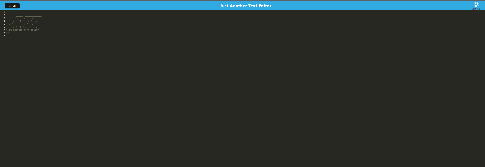
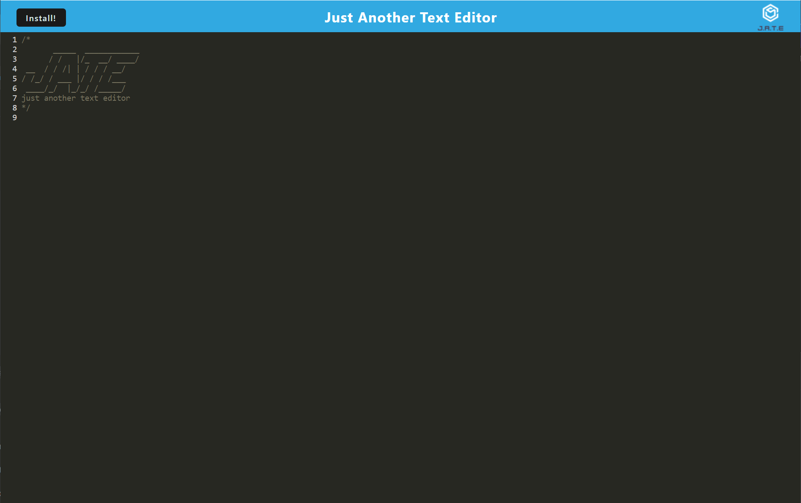

# J.A.T.E - Just Another Text Editor

## Description

Link to deployed page: [https://jate-meanbean87-5bf2910a6776.herokuapp.com/](https://jate-meanbean87-5bf2910a6776.herokuapp.com/)

This is a basic text editor that uses IndexedDB to store and update displayed text in a basic text-editor program. One of the major features to this application is that it has PWA capabilities and uses WebPack. WebPack is a bundler / tranpiler that automatically bundles applications in minified format to increase performance. Utilizing this allows the website to also be installed as a PWA or progressive web application.

Desktop Landing Page:



PWA Locally Installed Landing Page:



## Installation

For Development:

1. Clone or fork the repository from "https://github.com/MeanBean87/pwa-texteditor"
2. Navigate to the root directory of the project using CLI.
3. Install node modules using "npm install"
4. Open with the code editor of your choice

Node.js will need to be installed by the user.

Link to Node.js Downloads: [https://nodejs.org/en](https://nodejs.org/en)

## Usage

1. Visit the deployed page at [https://jate-meanbean87-5bf2910a6776.herokuapp.com/](https://jate-meanbean87-5bf2910a6776.herokuapp.com/)
2. *Optionally install the application using the install button.*
3. Enter text in the text field. - You can delete the Logo with no issues to the application.
4. Data should persist locally by use of IndexedDB.

## Code Highlights

Code snippet of the user model created with Sequelize.

```javascript
const HtmlWebpackPlugin = require("html-webpack-plugin");
const WebpackPwaManifest = require("webpack-pwa-manifest");
const path = require("path");
const { InjectManifest } = require("workbox-webpack-plugin");

module.exports = () => {
  return {
    mode: "development",
    entry: {
      main: "./src/js/index.js",
      install: "./src/js/install.js",
    },
    output: {
      filename: "[name].bundle.js",
      path: path.resolve(__dirname, "dist"),
    },
    plugins: [
      new HtmlWebpackPlugin({
        template: "./index.html",
        title: "JATE",
        favicon: "./src/images/favicon.png",
      }),
      new InjectManifest({
        swSrc: "./src-sw.js",
        swDest: "sw.js",
      }),
      new WebpackPwaManifest({
        fingerprints: false,
        inject: true,
        name: "Just Another Text Editor",
        short_name: "JATE",
        description:
          "A simple text editor that saves your content to IndexedDB",
        background_color: "#ffffff",
        theme_color: "#ffffff",
        start_url: "/",
        publicPath: "/",
        icons: [
          {
            src: path.resolve("src/images/logo.png"),
            sizes: [96, 128, 192, 256, 384, 512],
            destination: path.join('assets', 'icons'),
          },
        ],
      }),
    ],

    module: {
      rules: [
        {
          test: /\.css$/i,
          use: ["style-loader", "css-loader"],
        },
        {
          test: /\.m?js$/,
          exclude: /node_modules/,
          use: {
            loader: "babel-loader",
            options: {
              presets: ["@babel/preset-env"],
              plugins: ["@babel/plugin-proposal-object-rest-spread", "@babel/plugin-transform-runtime"],
            }
          },
        },
      ],
    },
  };
};


```

## Learning Points

Use and implementation of WebPack to create transpiled applications. Implementing service workers. Bundling progressive web applications.


## Technologies Employed

* Mini-CSS-Extract Plugin
* Webpack+Workbox
* Concurrently
* JavaScript
* IndexedDB
* Express
* NodeJS
* Babel

## Author

Michael Mattingly

Favicon owned by Michael Mattingly

* [GitHub](https://github.com/MeanBean87)
* [LinkedIn](https://www.linkedin.com/in/michael-mattingly-5580b1280/)

## License

This project is licensed under the [MIT License](https://github.com/MeanBean87/readme-generator/blob/main/LICENSE). Please refer to the LICENSE file for more details.
